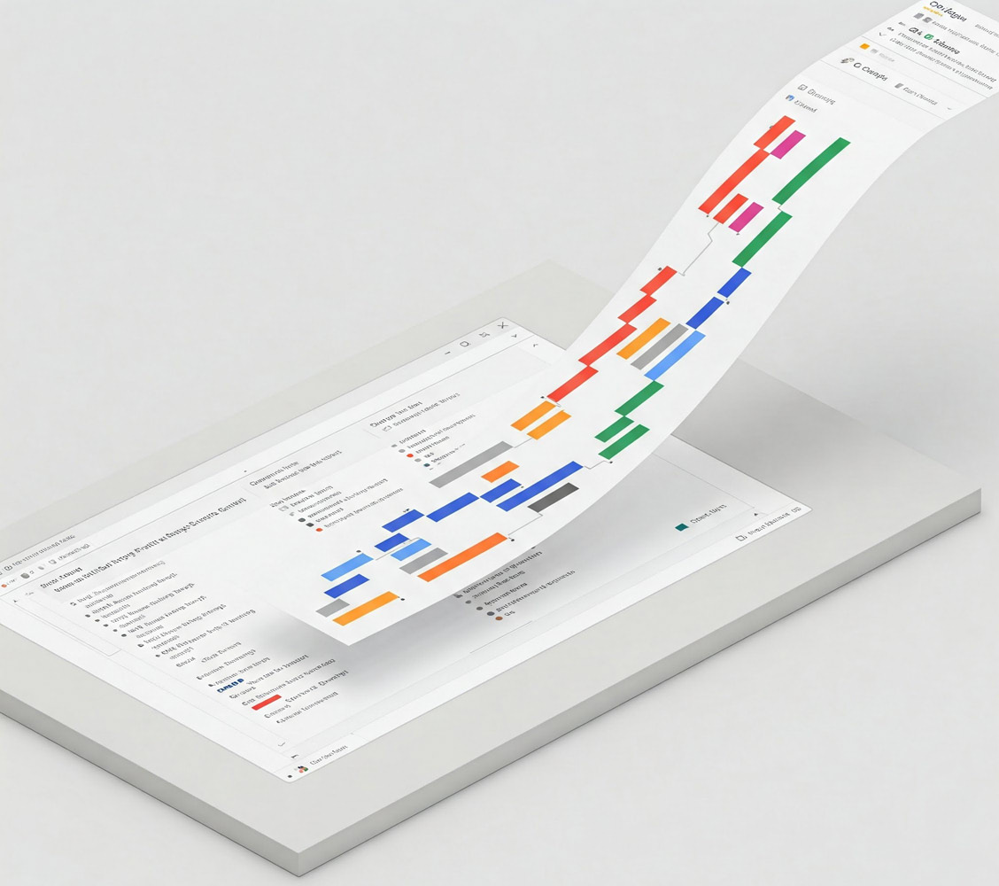
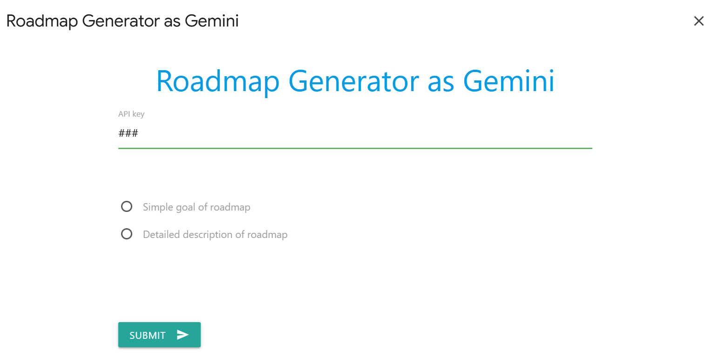
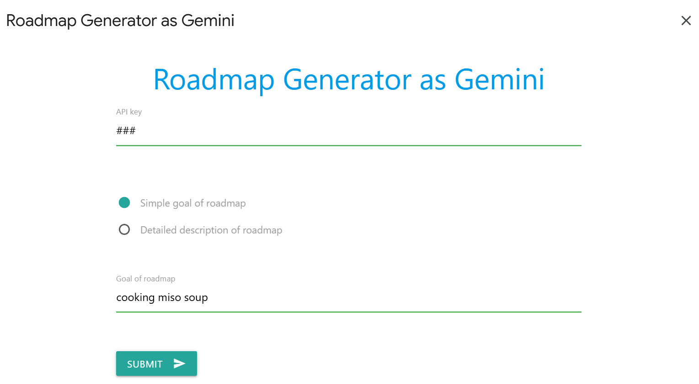
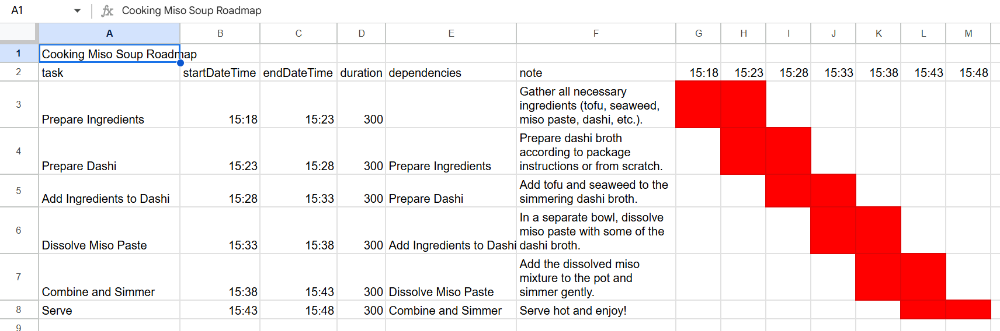
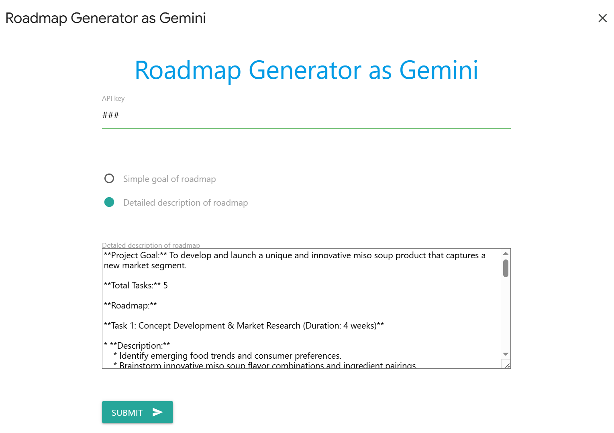
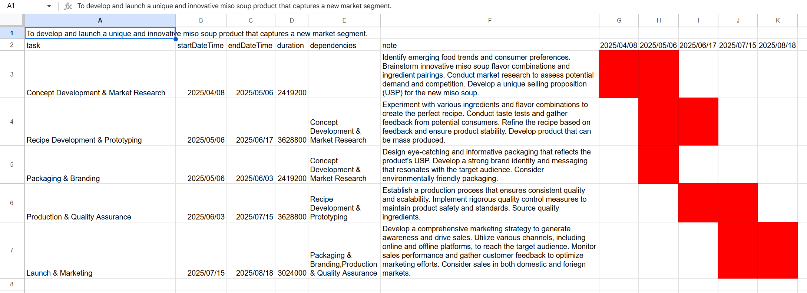

# Roadmap Generator as Gemini

<a name="top"></a>
[](LICENCE)



## Abstract

Gemini and Google Apps Script automate project roadmap creation in Google Sheets, including Gantt charts, improving efficiency and agile planning.

## Introduction

When initiating a new project, a comprehensive roadmap is crucial for successful execution. Previously, I meticulously crafted these roadmaps manually, a time-consuming process. However, leveraging the advanced capabilities of Google's Gemini, I've significantly streamlined this workflow. Gemini now assists in generating detailed project roadmaps, enhancing efficiency and accuracy. To further automate this process, I developed a Google Apps Script that dynamically constructs these roadmaps directly within Google Sheets, complete with integrated Gantt charts. This script facilitates the rapid generation of diverse project roadmaps, enabling agile planning and adaptation for future endeavors. This report details the functionality and implementation of this script, demonstrating its potential to optimize project planning and visualization.

## Repository

The repository of this project is [https://github.com/tanaikech/Roadmap-Generator-as-Gemini](https://github.com/tanaikech/Roadmap-Generator-as-Gemini).

## Usage

### 1. Get API key

In order to use the scripts in this report, please use your API key. [Ref](https://ai.google.dev/gemini-api/docs/api-key) This API key is used to access the Gemini API.

### 2. Copy the sample Google Sheet

In this case, I prepared a sample Google Sheet including the Google Apps Script. You can copy it and test the script.

When you access the following URL, you can copy the sample Google Sheet.

[https://docs.google.com/spreadsheets/d/1mymdd6cEv_ylGbXdCQJji9Dk3VeDNiNk78Gbk5yHB3E/copy](https://docs.google.com/spreadsheets/d/1mymdd6cEv_ylGbXdCQJji9Dk3VeDNiNk78Gbk5yHB3E/copy)

This script also includes a Google Apps Script library. [Ref](https://github.com/tanaikech/GeminiWithFiles)

You can see the whole script in the script editor of the copied Spreadsheet and [my repository](https://github.com/tanaikech/Roadmap-Generator-as-Gemini).

### 3. Testing

Please open the copied Google Sheet. And, run the script from "Open dialog" of the custom menu. You can see a dialog shown in the following image.

First, please set your API key.



#### Sample 1

As the 1st sample, please check the radio button of "Simple goal of roadmap". By this, you can see the dialog as follows.



In this sample, the following text is set. Here, the simple goal of the roadmap is set. By this, the detailed roadmap is automatically generated by Gemini.

```
cooking miso soup
```

When you click "SUBMIT" button, the script is run and the roadmap is generated. And, the generated roadmap is generated in the active sheet as follows. The start datetime of the roadmap is used as the datetime that the script was run.



In order to be highly visible in the image, I manually modified the date format after the roadmap was generated.

#### Sample 2

As the 2nd sample, please check the radio button of "Detailed description of roadmap". By this, you can see the dialog as follows.



In this sample, the following text is set. Here, the detailed description of the roadmap is set. By this, this description of the roadmap is resolved by Gemini, and the roadmap, including the Gantt chart, is automatically generated.

```
**Project Goal:** To develop and launch a unique and innovative miso soup product that captures a new market segment.

**Total Tasks:** 5

**Roadmap:**

**Task 1: Concept Development & Market Research (Duration: 4 weeks)**

* **Description:**
    * Identify emerging food trends and consumer preferences.
    * Brainstorm innovative miso soup flavor combinations and ingredient pairings.
    * Conduct market research to assess potential demand and competition.
    * Develop a unique selling proposition (USP) for the new miso soup.
* **Deliverables:**
    * Market research report
    * Concept document outlining flavor profiles, ingredients, and USP

**Task 2: Recipe Development & Prototyping (Duration: 6 weeks)**

* **Description:**
    * Experiment with various ingredients and flavor combinations to create the perfect recipe.
    * Conduct taste tests and gather feedback from potential consumers.
    * Refine the recipe based on feedback and ensure product stability.
    * Develop product that can be mass produced.
* **Deliverables:**
    * Finalized recipe
    * Product samples for testing

**Task 3: Packaging & Branding (Duration: 4 weeks)**

* **Description:**
    * Design eye-catching and informative packaging that reflects the product's USP.
    * Develop a strong brand identity and messaging that resonates with the target audience.
    * Consider environmentally friendly packaging.
* **Deliverables:**
    * Packaging design mockups
    * Brand guidelines

**Task 4: Production & Quality Assurance (Duration: 6 weeks)**

* **Description:**
    * Establish a production process that ensures consistent quality and scalability.
    * Implement rigorous quality control measures to maintain product safety and standards.
    * Source quality ingredients.
* **Deliverables:**
    * Production plan
    * Quality control procedures

**Task 5: Launch & Marketing (Duration: Ongoing)**

* **Description:**
    * Develop a comprehensive marketing strategy to generate awareness and drive sales.
    * Utilize various channels, including online and offline platforms, to reach the target audience.
    * Monitor sales performance and gather customer feedback to optimize marketing efforts.
    * Consider sales in both domestic and foreign markets.
* **Deliverables:**
    * Marketing plan
    * Sales reports
```

When you click "SUBMIT" button, the script is run and the roadmap is generated. And, the generated roadmap is generated in the active sheet as follows. The start datetime of the roadmap is used as the datetime that the script was run.



In order to be highly visible in the image, I manually modified the date format after the roadmap was generated.

## Summary

Gemini, integrated with Google Apps Script, automated project roadmap creation in Google Sheets. This process, previously manual, was streamlined, enhancing efficiency and accuracy. The script generated detailed roadmaps, including Gantt charts, facilitating agile planning. Sample tests demonstrated the script's ability to create roadmaps from simple goals or detailed descriptions.

## Note

- You can generate the roadmap many times. When the generated roadmap is not your expected one, you can generate it again.
- You can modify the script in the script editor of the copied Google Sheets. When you want to change the format of the roadmap, please modify it.
- In the current stage, when the Google search is used as the grounding of Gemini, `responseSchema` property in `generationConfig` cannot be used. When this is used, an error like `Unable to submit request because controlled generation is not supported with google_search tool. Learn more: https://cloud.google.com/vertex-ai/generative-ai/docs/model-reference/gemini` occurs. So, I used the JSON schema in the prompt. I believe that this will be resolved in the future update.
- The top image was created by Gemini using the introduction section.

---

<a name="licence"></a>

# Licence

[MIT](LICENCE)

<a name="author"></a>

# Author

[Tanaike](https://tanaikech.github.io/about/)

[Donate](https://tanaikech.github.io/donate/)

<a name="updatehistory"></a>

# Update History

- v1.0.0 (April 1, 2025)

  1. Initial release.

[TOP](#top)
